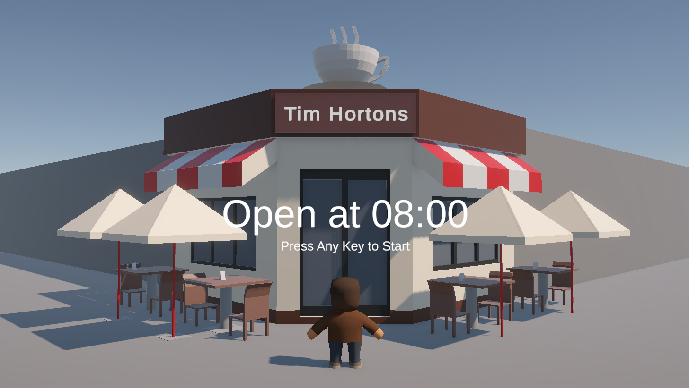
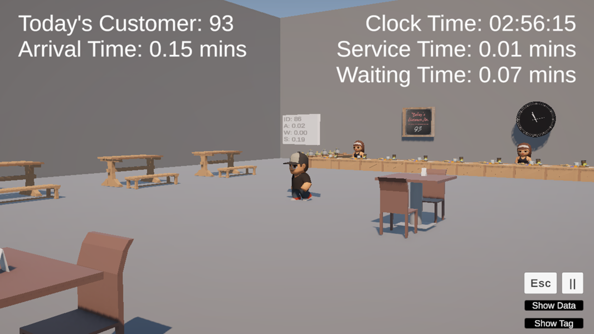
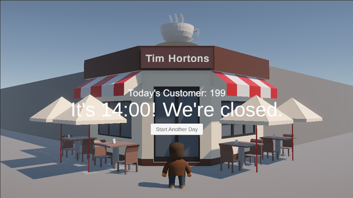

# TimHortonsSimulation

## Introduction
- It is a M/M/1 queue system simulation of Tim Hortons with opening hours from 08:00 to 16:00, where 6 hours are simulated in 1 minute.

## Gameplay
- PC Control: Use WASD to move, and the mouse movement to control the camera.

### Game Start

### Simulation 

### Game Over

## Build & Source Code
- Demonstration Video: https://youtu.be/39MNSWLmlmo
- WebGL Version Available (PC): yobisaboy.itch.io/tim-hortons-simulation
- Game Download: https://github.com/yobisaboy/TimHortonsSimulation
- Unity Project: https://github.com/yoyohohoh/COMP395_GroupProject/tree/simulations

## Contact
- Email: yobisaboy@gmail.com
- LinkedIn: https://www.linkedin.com/in/yoyoho
- Portfolio: https://yobisaboy.github.io/Portfolio

## Code Usage 
If you're interested in my code, you're welcome to use it for **non-profit purposes** — just show your support!
This code is **original** and owned by **yobisaboy**. There may be **third-party assets** involved in the game, please contact the corresponding owners for permission to use them.
### Usage Requirements
- Include the **logo** and give **proper credit** within your game and on any publishing platforms.
- **Redistribution or modification** must include appropriate attribution to **yobisaboy**.

### Support Me  
Thank you for your support! If you want, [Buy Me a Coffee!](https://buymeacoffee.com/yobisaboy) 

